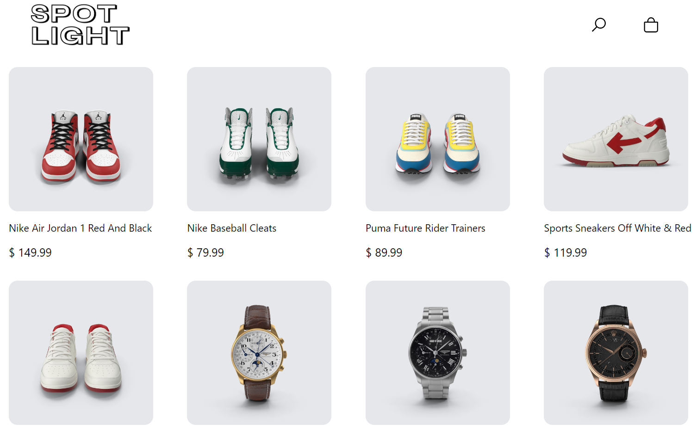
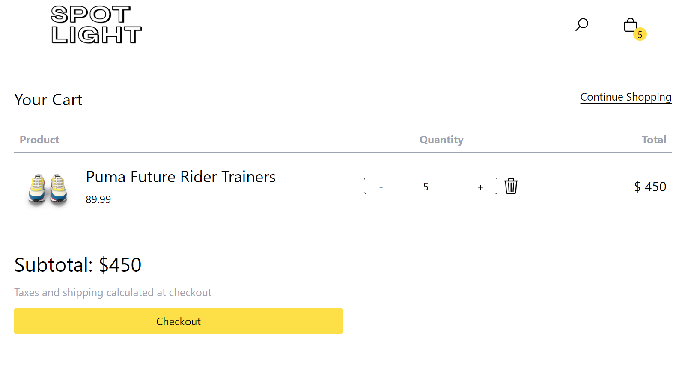
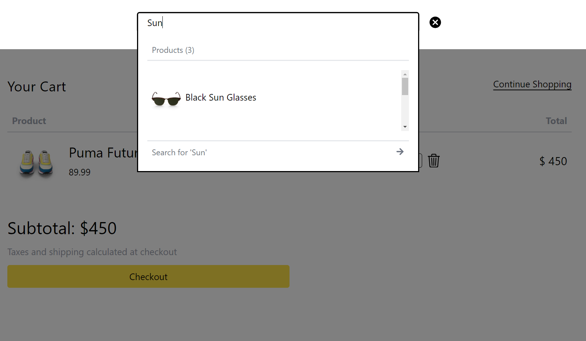

# SpotLight Store

SpotLight Store is a functional e-commerce web-application,  designed to provide users with a perfect shopping experience, where they can browse and search for products, and manage the cart.

## Core Features

- Search for products.
- Manage  the cart (add products, manage quantities, and track selections).

## Tech Stack

**Frontend:** ReactJS, Redux, TailwindCSS

**API Integration:** Data fetched from [DummyJSON](https://dummyjson.com/)

**Version Control:** Git and Github

## Note

This web app is a **frontend-only implementation** and does not include a backend or database. It is designed to showcase the user interface and frontend functionality.

## Demo

[View Demo](https://master--trial-app.netlify.app/)

## Screenshots

